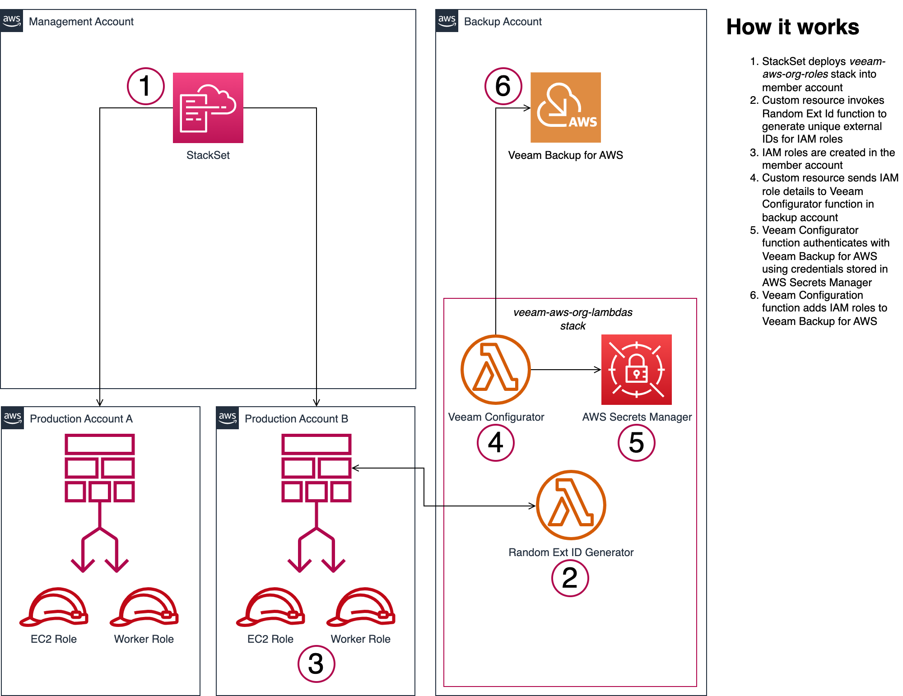

# Auto-Add Accounts in AWS Organizations to Veeam Backup for AWS

This project allows you to automatically add accounts managed by AWS Organizations to Veeam Backup for AWS.

## Getting started

Review the [Prerequisites](#prerequisites) to ensure your environment is configured properly before getting started. Detailed [instructions](#instructions) are further down on this page.

1) First, create the Lambda functions stack in the account where Veeam Backup for AWS is deployed (the _backup_ account). You can use the **Launch Stack** button below to do this.

    

1) When the Lambda functions stack has finished creating, visit [AWS Secrets Manager](https://console.aws.amazon.com/secretsmanager/) in the region where the stack was deployed to retrieve the credentials generated by the stack. The secret will be named _veeam-backup-aws-credentials_.

1) [Create a user account](https://helpcenter.veeam.com/docs/vbaws/guide/accounts_vba_users_create.html) on the Veeam Backup for AWS console with [Portal Administrator](https://helpcenter.veeam.com/docs/vbaws/guide/accounts_vba_users.html) rights using the generated credentials. These credentials will be used by the Veeam configurator function to authenticate with the Veeam Backup for AWS REST API.

1) In the management account (or a [delegated administrator account](https://docs.aws.amazon.com/accounts/latest/reference/using-orgs-delegated-admin.html)), create a StackSet using the [Veeam AWS Org Roles template](https://veeamhub-public.s3.amazonaws.com/veeam-aws-cloudformation/veeam-backup-aws/aws-org-roles/veeam-aws-org-roles.template) to deploy the IAM roles that will be used for Veeam operations. The S3 URL for the template is: <https://veeamhub-public.s3.amazonaws.com/veeam-aws-cloudformation/veeam-backup-aws/aws-org-roles/veeam-aws-org-lambdas.template>

1) Any accounts belonging to your StackSet deployment target will have roles created in them for Veeam operations. When the roles are deployed to a member account, the [Lambda-backed custom resources](https://docs.aws.amazon.com/AWSCloudFormation/latest/UserGuide/template-custom-resources-lambda.html) in the roles stack will invoke the functions in the backup account to add the roles to Veeam Backup for AWS.

## Resources

The following resources are created by two separate CloudFormation templates.

In an account where Veeam Backup for AWS is deployed (the _backup_ account), the [Veeam AWS Org Lambda functions template](https://veeamhub-public.s3.amazonaws.com/veeam-aws-cloudformation/veeam-backup-aws/aws-org-roles/veeam-aws-org-lambdas.template) creates:

* (2) Lambda functions and (2) Lambda execution roles
  * A function which generates a random [external ID](https://docs.aws.amazon.com/IAM/latest/UserGuide/id_roles_create_for-user_externalid.html) for trust policies on IAM roles that are deployed to the organization
  * A VPC-connected function which adds IAM roles to the Veeam Backup for AWS console when an account is added to the organization
* (1) Secret stored in AWS Secrets Manager
  * A username and password for a [Portal Administrator](https://helpcenter.veeam.com/docs/vbaws/guide/accounts_vba_users.html) on the Veeam Backup for AWS console
* (1) VPC endpoint for AWS Secrets Manager
  * Private access to the AWS Secrets Manager service for the VPC-connected Lambda function

In an organization member account, the [Veeam AWS Org Roles template](https://veeamhub-public.s3.amazonaws.com/veeam-aws-cloudformation/veeam-backup-aws/aws-org-roles/veeam-aws-org-roles.template) creates:

* (2) IAM roles
  * An IAM role for performing EC2 data protection operations
  * An IAM role for deploying worker instances into member accounts (if required)

## Prerequisites

* This configuration assumes you have already deployed Veeam Backup for AWS. If you have not deployed Veeam Backup for AWS, please visit the [Deployment section](https://helpcenter.veeam.com/docs/vbaws/guide/deployment.html) of the Veeam Backup for AWS user guide for instructions.

* The VPC-connected Lambda function does not require internet access. It does require access to Amazon S3 and AWS Secrets Manager.

  * Secrets Manager is used to store user credentials for the Veeam Backup for AWS console.

  * Access to S3 is required for the function to send responses to CloudFormation.
  
  * As such, the subnet into which you deploy the VPC-connected Lambda function must have access to S3. If the subnet is private or does not have a NAT gateway available, an [S3 gateway endpoint](https://docs.aws.amazon.com/vpc/latest/privatelink/vpc-endpoints-s3.html) will work.

* The Veeam Backup for AWS EC2 instance must have a security group associated that allows TCP/11005 from the subnet where the VPC-connected Lambda function is attached. This is the default port that Veeam Backup for AWS uses for its REST API. More details are available in the [Ports](https://helpcenter.veeam.com/docs/vbaws/guide/system_requirements_ports.html) section of the Veeam Backup for AWS user guide.

* This project assumes you are using [AWS Organizations](https://docs.aws.amazon.com/organizations/latest/userguide/orgs_introduction.html) and have IAM roles configured for CloudFormation to perform stack deployments into your organization's accounts. You can use either self-managed permissions or service-managed permissions to perform deployments using StackSets.

  For more information on AWS Organizations and CloudFormation StackSets, visit the following AWS user guides:

  * [AWS CloudFormation StackSets and AWS Organizations - AWS Organizations User Guide](https://docs.aws.amazon.com/organizations/latest/userguide/services-that-can-integrate-cloudformation.html)

  * [Prerequisites for stack set operations](https://docs.aws.amazon.com/AWSCloudFormation/latest/UserGuide/stacksets-prereqs.html)

## Instructions

### Create Lambda functions stack in backup account

1) Login to the AWS account which will serve as the backup account.
1) Navigate to the CloudFormation service.
1) On the left column, select **Stacks**.
1) In the upper right corner, select the **Create stack** dropdown, then choose **With new resources (standard)**.
1) In the **Amazon S3 URL**, paste the following template URL: <https://veeamhub-public.s3.amazonaws.com/veeam-aws-cloudformation/veeam-backup-aws/aws-org-roles/veeam-aws-org-lambdas.template>
1) Click **Next**.
1) Enter a name for the stack, e.g., _veeam-aws-org-lambda_
1) Five parameters are required. Each is described on the stack details page.
    * **AWS Organization ID** - The [Organization ID](https://docs.aws.amazon.com/organizations/latest/userguide/orgs_manage_org_details.html)  is used to prevent the functions from being invoked from accounts which do not belong to your organization.
    * **VPC ID** - The VPC ID where the VPC-connected function will be deployed.
    * **Subnet ID** - The Subnet ID where the VPC-connected function will be attached.
    * **Security group ID** - The security group ID which will be associated with the AWS Secrets Manager endpoint to allow the VPC-connected function to access it.
        * Example: If the CIDR block of the subnet where the VPC-connected function will be deployed is 10.0.0.0/24, the security group must allow TCP/443 (HTTPS) from 10.0.0.0/24.
    * **Veeam instance IP** - The private IP address of the Veeam Backup for AWS appliance.
1) Click **Next**.
1) Add your settings on the _Configure stack options_ page, then select **Next**.
1) Review your settings, then scroll to the bottom of the page and tick the checkbox, **I acknowledge that AWS CloudFormation might create IAM resources**.
1) Click **Submit** to create the stack. It will take a few minutes to create the stack.
1) When the stack has finished creating, select the _Outputs_ tab and copy the two ARN values to your clipboard or notepad. You will need these ARNs for the StackSet.

### Retrieve credentials and create the Veeam Backup for AWS user

1) Select the _Resources_ tab on the Lambda functions stack and click the _Physical ID_ link for the **VeeamSecret** resource. You can also navigate to the [AWS Secrets Manager](https://console.aws.amazon.com/secretsmanager/) console and select the secret named _veeam-backup-aws-credentials_.
1) In the **Secret value** section, click **Retrieve secret value**. Copy the generated credentials to your clipboard or notepad.
1) Follow the instructions in the Veeam Backup for AWS user guide to [create a user account](https://helpcenter.veeam.com/docs/vbaws/guide/accounts_vba_users_create.html) with [Portal Administrator](https://helpcenter.veeam.com/docs/vbaws/guide/accounts_vba_users.html) rights using the generated credentials. These credentials will be used by the Lambda configurator function to authenticate with the Veeam Backup for AWS REST API.
1) In the backup account, navigate to the EC2 service console and select your Veeam Backup for AWS instance.
1) With your Veeam instance selected, in the bottom window, select the _Security_ tab, then click the **IAM Role** link for the role attached to your instance. You will be taken to the role details in the IAM console.
1) On the _Summary_ page for the role attached to your Veeam instance, **copy the ARN of the role** to your clipboard or notepad. You will need this value in addition to the Lambda ARN values copied from an earlier step to deploy the StackSet in the next section.

### Create StackSet for Veeam IAM roles

1) Login to the organization management account (or a [delegated administrator account](https://docs.aws.amazon.com/accounts/latest/reference/using-orgs-delegated-admin.html)).
1) Navigate to the CloudFormation service.
1) On the left column, select **StackSets**.
1) In the upper right corner, click **Create StackSet**.
1) Select either **Service-managed permissions** or **Self-service permissions** depending on your environment. For more details on organization permissions, review the [prerequisites](#prerequisites) section of this page.
1) In the **Amazon S3 URL** field, paste the following template URL: <https://veeamhub-public.s3.amazonaws.com/veeam-aws-cloudformation/veeam-backup-aws/aws-org-roles/veeam-aws-org-roles.template>
1) Click **Next**.
1) Enter a name for the StackSet, e.g., _veeam-aws-org-roles_
1) Enter the parameters for the StackSet using the values you copied to your clipboard or notepad from previous steps.
    * **Veeam instance role ARN**
    * **Veeam configurator function ARN**
    * **Random external ID generator ARN**
1) Enter your options on the _Configure StackSet options_ page, then click **Next**.
1) On the _Set deployment options_ page, leave **Deploy new stacks** selected, then select **Deploy to organization** if you want to deploy the roles to all accounts, or **Deploy to organizational units (OUs)** if you want to deploy roles only to accounts within a particular OU.
1) Choose an **Automatic deployment** option, then choose an **Account removal behavior** option.
1) In the _Specify regions_ section, **select the region where the Lambda functions stack was deployed**.

    **IMPORTANT**: "You can invoke a Lambda function from a custom resource in a different account only if the Lambda function and the custom resource are in the same AWS Region."

    Reference: [Use a Lambda function created in one AWS account with an AWS CloudFormation custom resource in another AWS account](https://aws.amazon.com/premiumsupport/knowledge-center/cloudformation-lambda-custom-resource/)

1) Set your _Deployment options_, then click **Next**.
1) Review your settings, then scroll to the bottom of the page and tick the checkbox, **I acknowledge that AWS CloudFormation might create IAM resources**.
1) Click **Submit** to create the StackSet.

The StackSet will be created and any accounts belonging to your StackSet deployment target will have roles created in them for Veeam operations. The [Lambda-backed custom resources](https://docs.aws.amazon.com/AWSCloudFormation/latest/UserGuide/template-custom-resources-lambda.html) in the stack will invoke the functions to add the roles to the Veeam Backup for AWS console.

## Notes

Please feel free to customize to your specific use case. In this example, we are only deploying IAM roles and policies to protect EC2 resources. You can add other roles and policies to the StackSet template to protect other supported resources. For a list of supported resources and required permissions, visit the [user guide](https://helpcenter.veeam.com/docs/vbaws/guide/welcome.html).

For each role that you deploy to your organization, you must create two custom resources:

1) **Custom::RandomExtIdGenerator** resource - Invokes the _RandomExtIdLambda_ function to create a unique [external ID](https://docs.aws.amazon.com/IAM/latest/UserGuide/id_roles_create_for-user_externalid.html) for the role being created in the member account
1) **Custom::VeeamAwsConfigurator** resource - Invokes the _VeeamConfiguratorLambda_ function to add the role to the Veeam Backup for AWS console

The **Custom::VeeamAwsConfigurator** resource includes properties that give the Lambda function the data it needs to process the roles. If you create other roles and wish to have them added to the Veeam Backup for AWS console, be sure to include the properties specified on the custom resources in the _veeam-aws-org-roles_ template so the Lambda functions will have what they need.

In particular, the _Purpose_ property is a string which will be appended to the role name as it appears in the Veeam Backup for AWS console. This exists and is used solely for ease of use purposes. For example, if you create a role for performing backup operations for EFS, you can specify "_efs_" as the purpose, and when the role is added to Veeam, it will appear as _\<AWS-account-id>-**efs**_.

## Credits

Created by [Eric Ellenberg](https://github.com/couplebits), Veeam Software
